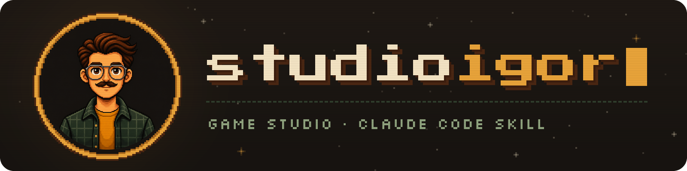

<div align="center">



**The ultimate game-development tool for Claude Code** — from the author of the YouTube channel [@studioigor](https://www.youtube.com/@studioigor).

A game studio inside Claude Code: from "I want to make a racing game" to a playable, polished game — step by step, with you in the director's chair.

**English** · [Русский](README.ru.md)


[](https://www.youtube.com/@studioigor)


</div>

## Install in one prompt

Send this prompt to your agent (Claude Code recommended, but works with others):

```text
Install the skill studioigor https://github.com/studioigor/studioigor-skill
```

Then send to your agent: `/studioigor` and just describe the game you want.

---

**studioigor** works like a real game studio on your computer. The skill interviews you, shows you real references, sets up the best toolchain for your engine, builds every mechanic in its own playable test scene — and only then assembles the game, with story, cutscenes, progression and polish.

**You decide taste. The studio does everything else.**

## How it feels

```text
You     I want to make a racing game. Night city, drifting, a bit of story.
Studio  Three quick questions — camera, scale, story — each with a recommended answer.
Studio  Pitch card: "Night Drift — own the city one corner at a time."
        Approve · Bolder · Change one thing
Studio  Opens a local board: 4 style directions with real references. You like a few, press Send.
Studio  Compares Godot, Unity and Web for this game, installs the winner with its CLI and editor MCP.
Studio  Builds a drift gym with live tuning sliders. "Try the S-bend, then hold nitro."
You     Feels floaty.
Studio  More grip, more weight. "Is it fun now?"  →  mechanic locked, committed, on to the next.
```

## The pipeline

| # | Phase | You | The studio |
|---|---|---|---|
| 1 | Idea | answer 2–3 rounds of multiple-choice questions | pitch card, pillars, story skeleton, mechanics list |
| 2 | Style | click what you like on a local board | downloads real references, iterates until the style is locked, writes an art bible |
| 3 | Platform & engine | pick where the game ships | compares engines for *this* game — installed or not |
| 4 | Environment | nothing, or one click when a login is needed | installs the full setup: engine CLI, editor MCP, Blender for 3D, plugins, LSP, frame capture |
| 5 | Assets & look-dev | approve one "this is how it will look" scene | Blender models, procedural 2D, CC0 packs, a license registry |
| 6 | Mechanics | play each test scene, say what's off | one mechanic at a time, each in its own gym with live tuning |
| 7 | Vertical slice | play the first real chunk | menu → game → result, with sound, story and a "game-ness" checklist |
| 8 | Content | play each batch | levels as data, each different on two axes, story beats and cutscenes |
| 9 | Polish | say "good enough" | juice, sound, the first 60 seconds, performance — one biggest gap per round |
| 10 | Release | decide whether and where to publish | platform research, ship gates, builds, store art from real captures |

## What makes it different

- 🎮 **You play early and often.** Every mechanic gets a "gym" — dummies for combat, a test
  track for driving — with sliders you can tweak yourself.
- 🖼️ **Real references, not AI mush.** Screenshots, gameplay frames and art are downloaded onto
  a local board. Image generation is only ever an extra.
- 🛠️ **The best toolchain, set up for you.** Research first, then the full kit for your engine,
  not the minimum: Godot, Unity, Unreal, web, Defold, Bevy.
- 💡 **It invents, you approve.** A game-designer layer pitches signature hooks, synergies and
  memorable moments as short idea cards. Nothing goes in without your "yes".
- ⚖️ **Blind A/B for what matters most.** For core feel, the key frame and the first minute, a
  "gauntlet" compares your game with a reference bar — the verdict is written before the reveal.
- 🎯 **Game first.** A built-in balance check warns when effort drifts into tests, docs or tooling.
- 💾 **Never lost, never pushed.** Every decision lives on disk and in git; resume from any point.
  Subagents work in git worktrees. Nothing is pushed or published unless you ask.
- 🧠 **Learns without rewriting itself.** Better techniques are saved to `user-choices/`, and
  only after you approve them. Your taste stays with the game you said it about: the next
  game starts clean, only rules about how to work carry over.
- 🌍 **Speaks your language.**

## Autopilot: "make the game yourself"

```text
You      Make the game yourself tonight.
Studio   Start independent development?  Yes  ·  Goal: playable slice  ·  Time: ~10 h
         → a CronCreate schedule launches ticks; each tick is a fresh agent that takes one step and commits
Morning  REPORT.md: how to play in one command · what was built · decisions made for you, ready to review
```

On autopilot the studio decides taste on your behalf and logs every such decision for your
review. It playtests from captures and numbers, and stops by itself when the goal is reached,
time runs out or it gets stuck. It never pushes, publishes, pays or logs in.

## Try saying

- *"I want to make a cozy farming game for the browser"*
- *"Let's make a top-down shooter with a story"*
- *"Finish my game"* — inside an existing project
- *"Back to the style"* — reopen any phase at any time
- *"Make the game yourself while I sleep"*

## Requirements

Claude Code, Python 3.9+, git, macOS or Linux (Windows via WSL). Engines, Blender,
ffmpeg and the rest are installed by the skill when your game needs them.

## License

MIT — see [LICENSE](LICENSE).

## Links

- 📺 YouTube channel: [@studioigor](https://www.youtube.com/@studioigor)
- 💬 Discord server: [discord.gg/Jb7dBHSDG](https://discord.gg/Jb7dBHSDG)
- 📲 Telegram channel: [t.me/studioigor](https://t.me/studioigor)
- ❤️ Support the channel on Boosty: [boosty.to/studioigor](https://boosty.to/studioigor)
- ⚡️ Donate: [boosty.to/studioigor/donate](https://boosty.to/studioigor/donate)
